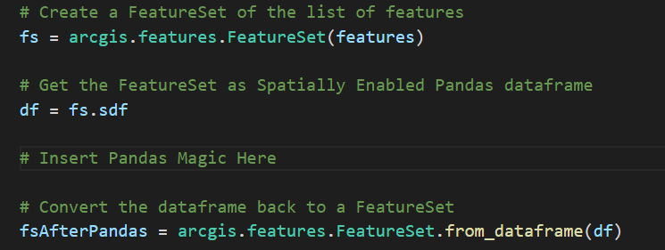

# ArcGIS and Pandas

## ArcGIS_and_Pandas.py
This sample shows how ArcGIS Data can be converted to a Pandas dataframe and back.

The FeatureSet used in this sample is created by creating a feature from a python dictionary. But a FeatureSet as result from a query to a FeatureLayer can also be used.