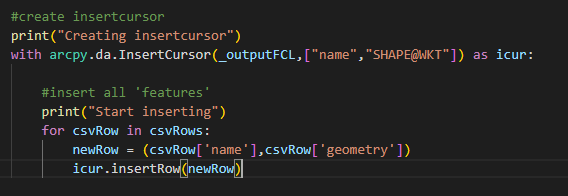

# CSV with WKT

This sample shows a script that imports a CSV file with a geometry in WKT-string format.

The script uses the functionality of the [arcpy.da.InsertCursor](https://pro.arcgis.com/en/pro-app/latest/arcpy/data-access/insertcursor-class.htm). With the Field tokens it is possible to use a WKT string as input for the geometry.

