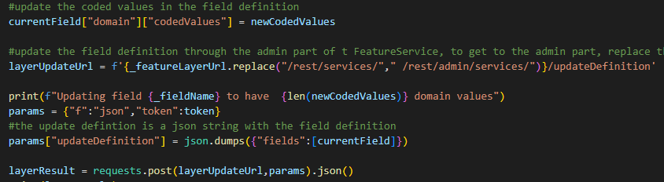

# Change Domains

This script updates the coded value domains of a field in a FeatureService Layer or Table to a new set of values using the REST API.

 

Learn more about the Update Definition: [here](https://developers.arcgis.com/rest/services-reference/enterprise/update-definition-feature-layer-.htm).
