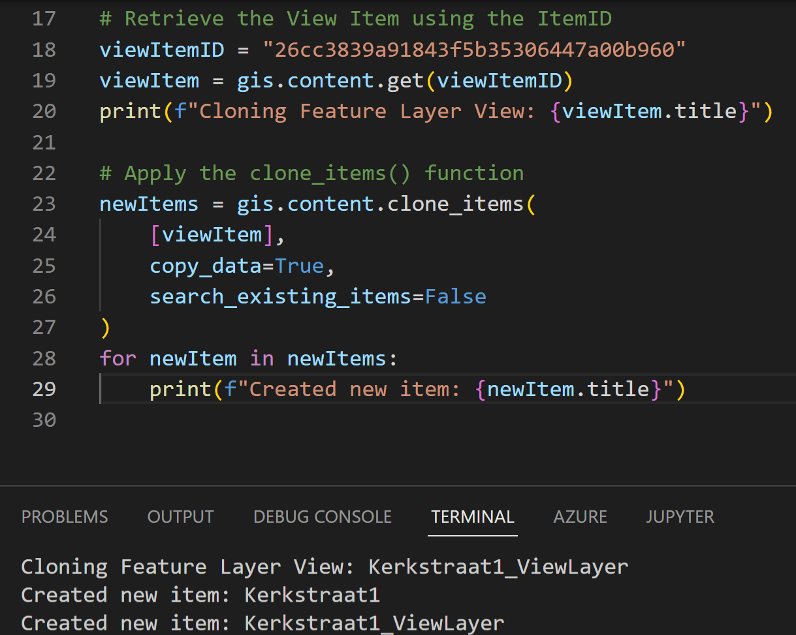

# Cloning a Feature Layer View

With the `clone_items()` function in the ArcGIS API for Python, it is possible to create a clone of your Content in ArcGIS Online or Portal. The clone is a copy of the original item, with the same name and description, but with a different ID. When applying the `clone_items()` with the `copy_data` property set to `True` on a Feature Layer View, not only the View itself it cloned, but the Feature Layer it is created from as well. 
  
 
  
To learn more about the `clone_items()` function see the ContentManager documentation [here](https://developers.arcgis.com/python/api-reference/arcgis.gis.toc.html#contentmanager).
