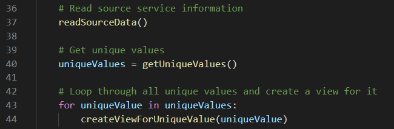
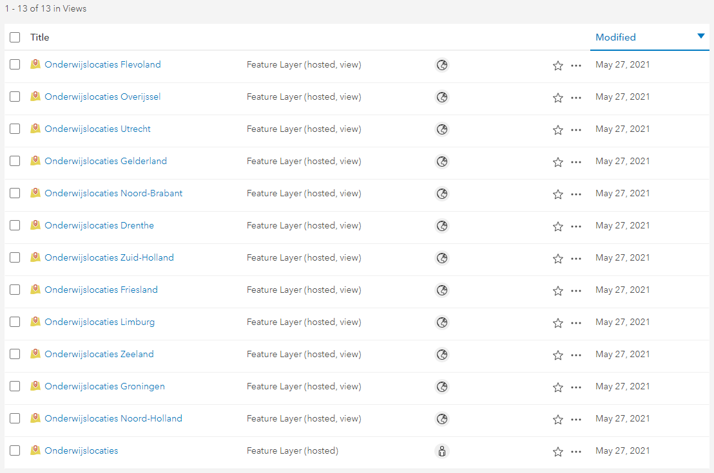

# Create Views from a Feature Service

This script creates views based on values in a feature service. This is useful when you have a dataset that you want to present to different users based on a value. This could be a users email address or any other value on which you want to create a subset of the data specific for the user or group. This script creates views containing schools in the Netherlands. Per province, a view is created containing only the schools in that province using a Definition Expression. 

To create views using a Python script and the ArcGIS REST API you need to take the following steps:

1. Query the feature service for unique values to filter the source data
2. For each value, create a new feature service view
3. Add the layer definition of the source feature service to the view that was created
4. Update the layer in the view to add the Definition Expression for the selected value
5. In this case, the source feature service is private, while all views are being shared publicly

 

 
