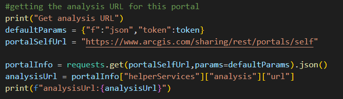

# Finding the analysis serivce url and use it to generate Tesselations

Finding the analysis url for your ArcGIS Portal. 

 

To learn more about the spatial analysis options see: https://developers.arcgis.com/rest/analysis/api-reference/getting-started.htm 
