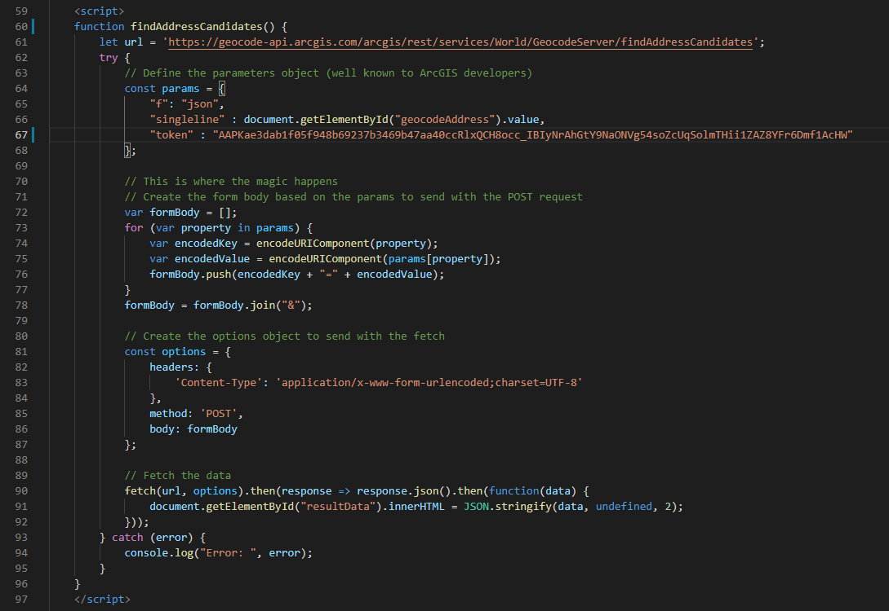

# Fetch data from an ArcGIS REST service

This sample shows how to use "fetch" in Vanilla JavaScript to make POST requests with parameters to ArcGIS REST services.

You can of course use Esri's libaries, more specific [esri/request](https://developers.arcgis.com/javascript/latest/api-reference/esri-request.html), or frameworks and libraries like Angular, ReactJS or VueJS. But some web pages are just static with very little logic and don't use Esri libraries or frameworks. That's when you would use Vanilla JavaScript. Besides, frameworks and libraries come and go. Good old vanilla JavaScript is here to stay.

 
 
View this example live:
[here](https://esrinederland.github.io/CoolScripts/JsFetchREST/)