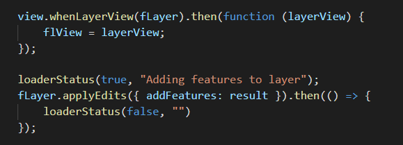

# LayerView
 
This code snippet shows how to "really" add all features from a layer to the client in JavaScript.
 
For this you first load all features into a FeatureSet, upon which you create a FeatureLayerView from that FeatureSet.