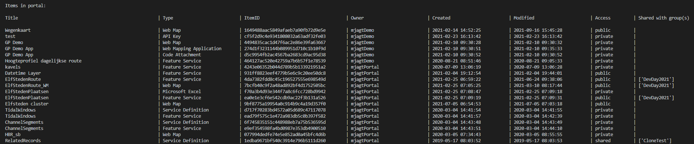

# List Portal Items
 
This example shows how to list the items in your portal. You can choose which type of items to list by changing the value of the 'listItemTypes' variable on line 11.
 
 
By using ["*"] as value the script will list all item types. If you want specific item types you can add a comma seperated list of strings containing the item types. The item types that you can use are specified in the documentation: https://developers.arcgis.com/rest/users-groups-and-items/items-and-item-types.htm