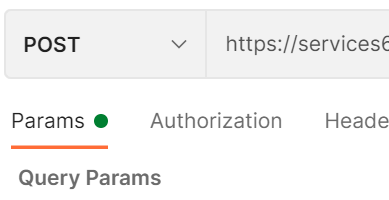
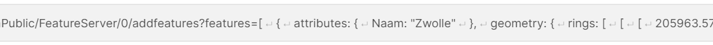
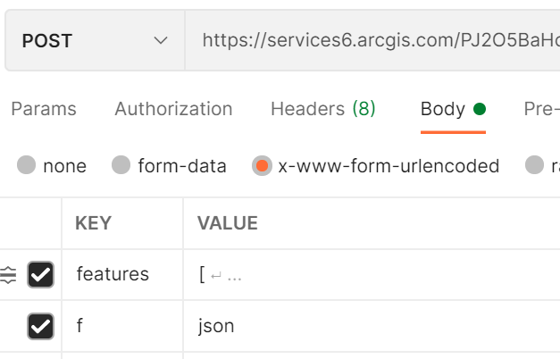

# Postman

## Generate Token:
This shows how to use Postman to generate a token for use in various applications.

Sometimes you need a token "quick and dirty", for example when you want to access a secured REST endpoint to test a query or check something on the service while developing your app or script. This simple Postman request does just that. Replace username and password with the ones from a user in your organization to generate a token that you can copy-paste into the url that accesses your service.

## Add Features (and other POST requests):
When using Postman to execute a POST request, you need to pay close attention to the requests parameters. Postman has an option for adding "Params". 

This will indeed add params and still send the request as POST, but will add them to the url as it would with a GET request. 

The url however has a length restriction of 2048 characters. So if the content of your params exeeds 2048 characters, your request will fail.

To demonstrate this you will find 3 "addFeature" requests in this Postman collection. The first one adds a small polygon of a neighbourhood in Zwolle to a featureservice. It uses the "Params" option in Postman to add the "features" parameter and it's value that contains coordinate pairs that make up the polygon. The total size of the "features" parameter value is 1024 characters. This is well within the limit of 2048 so the request will execute just fine.

The second request uses Postmans "Params" again to add a "features" parameter, but in this case it's a polygon of the whole municipality of Zwolle. This polygon contains way more coordinate pairs and adds up to a total length of 107327 characters. A bit more than the limit of 2048. This request will therefore fail. Where a successful request will return a HTTP status code "200", this will return a "414" which means the URI is too long (https://developer.mozilla.org/en-US/docs/Web/HTTP/Status/414).

The "correct" way of sending POST requests in Postman, where the length of the parameters doesn't matter (within certain limits of course), is to add them to the "Body" of your request. You can choose to add them as "x-www-form-urlencoded" as key-value pairs, just as you would in "Params". 

This will not add them to the url but encloses them in the body of the request message and therefore there is no restriction in the length of the "features" parameter. With this request it's possible to add the polygon of the whole municipality of Zwolle to the featureservice without any problems.
