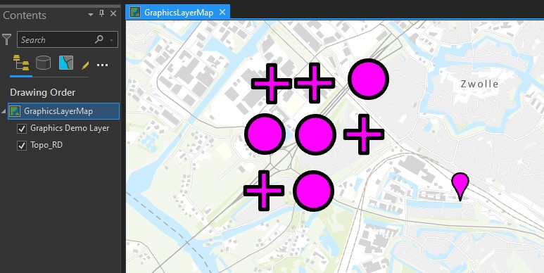

# ArcGIS Pro SDK GraphicsLayers
 
This Example shows how you can use [GraphicsLayers](https://pro.arcgis.com/en/pro-app/latest/sdk/api-reference/#topic29442.html) to add Graphics to a map that are not stored in a database, service or on disk.
 

 
Learn about GraphicsLayers here: https://github.com/esri/arcgis-pro-sdk/wiki/ProConcepts-GraphicsLayers
  
And get all documentation about the ArcGIS Pro SDK here: 
https://pro.arcgis.com/en/pro-app/latest/sdk/