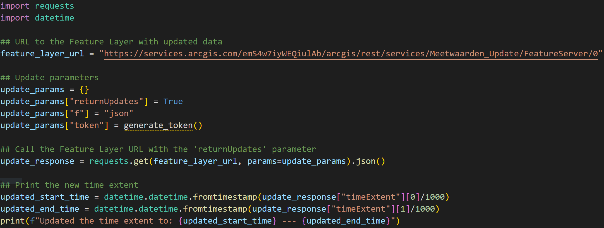

# Feature Service ReturnUpdates
Update the time extent of your Feature Layer, when the time extent of the data changes. Making use of the Feature Layer request parameter `returnUpdates`.

Learn more about the Feature Layer request parameters: [here](https://developers.arcgis.com/rest/services-reference/enterprise/layer-feature-service-.htm#GUID-C9CF4369-79BD-41E1-AD62-D1A0328F370E)

 

