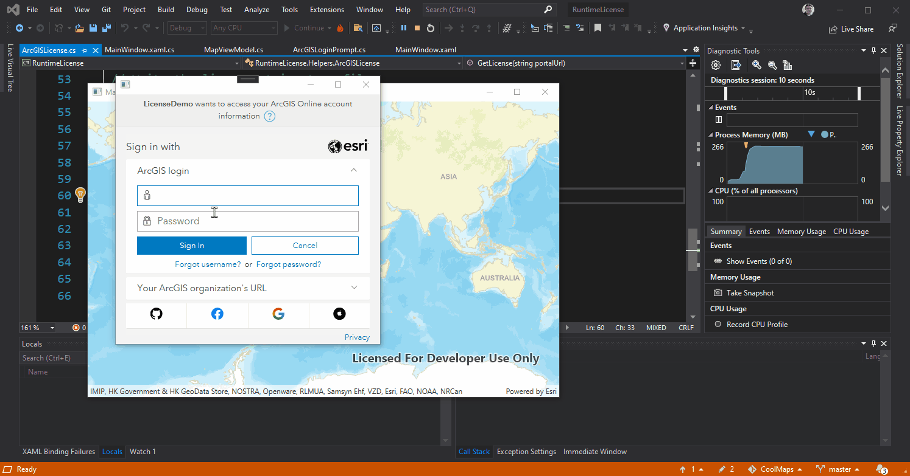

# Runtime license from a named user

This sample shows how you can activate a [ArcGIS Runtime](https://developers.arcgis.com/net/) license from a named user.

In this case the .NET runtime but the functionality is roughly the same for all other runtimes.




When the user is signed in the code gets a ```licenseInfo``` object from the ```ArcGISPortal``` object.

Remember to set the ```ChallengeHandler``` before getting a license.
