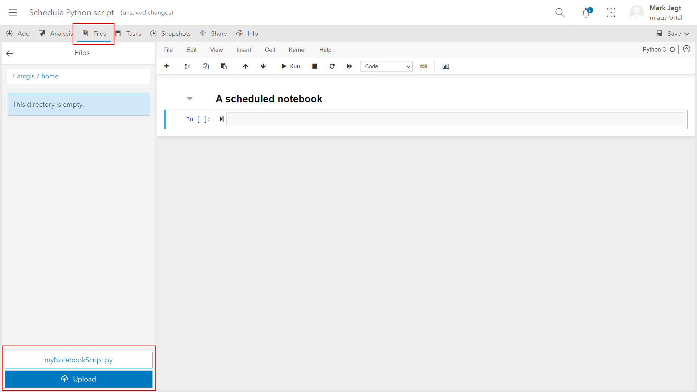
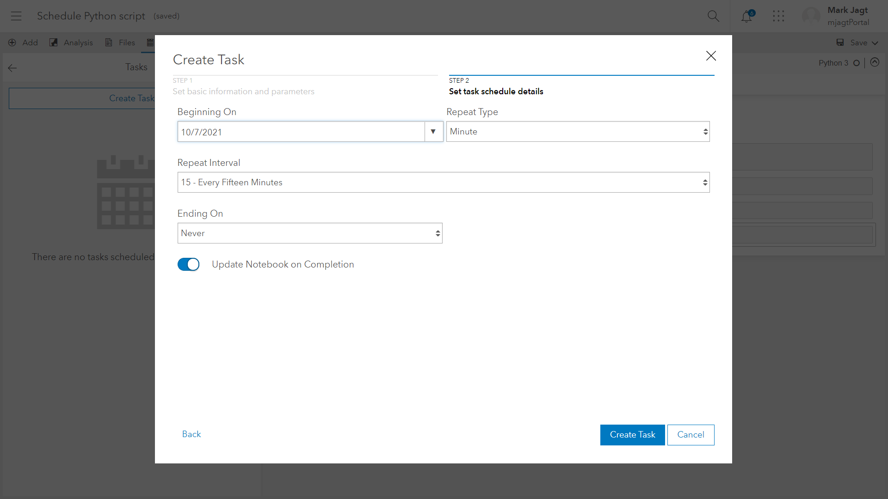

# Schedule a python script using an ArcGIS Online Hosted Notebook
You can schedule your own Python scripts using ArcGIS Online Hosted Notebooks. This eliminates the need of having your own server to schedule scripts. If you want to use ArcPy functionality you will need to create an "Advanced" Notebook, otherwise a "Standard" Notebook is sufficient. And of course you can't use local data sources when using ArcGIS Online Hosted Notebooks.
 
These are the steps to schedule a script called "myNotebookScript.py":
 
1. Create a new Notebook (in this case we choose "Standard")
 
 
2. Save the Notebook to enable the "Tasks"
 
 
 
3. Delete all existing cells, except the title
 
4. Navigate to Files > home and add (upload) myNotebookScript.py
 
5. Add a new cell and add "import sys" and  the path to home folder
6. Add another cell and add "import myNotebookScript"
 
7. Add another cell and add a line of code to execute one function in the Python script
8. Add another cell and add a line of code to execute the complete Python script (by calling the function "RunCompleteScript")
 
9. Create a task and call it "Execute Script"
 
10. Add the parameters "username" and "password" to the task. This allows you to pass variables into the script, so you don't have to store a username and password in the script itself
 
11. Set a schedule for the task
 
12. Save the task
 
 
The task will now run at whatever schedule you have chosen. The minimum interval is 15 minutes, so you can't run the script more often than that.
 
 
By clicking on the task you reveal all runs.
 
 
By clicking on the results of a run you reveal the executed Notebook, which itself has executed your Python script.
 