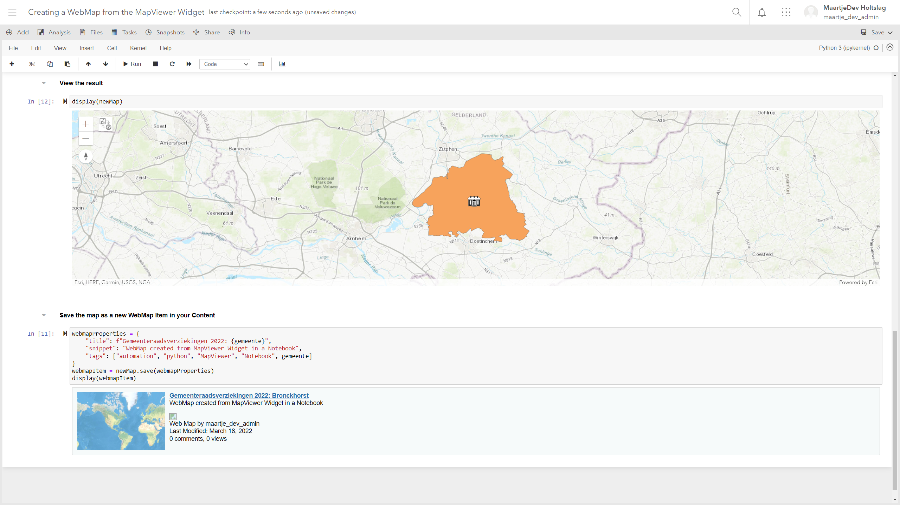

# Creating a WebMap from the MapViewer Widget in a Notebook
This Notebook shows how you can create a Map in the MapViewer Widget in an ArcGIS Hosted Notebook and save it as a new WebMap Item in your Portal. 
<br>
<br>

<br>
```
webmapProperties = {
    "title": f"Gemeenteraadsverziekingen 2022: {gemeente}",
    "snippet": "WebMap created from MapViewer Widget in a Notebook",
    "tags": ["automation", "python", "MapViewer", "Notebook", gemeente]
}
webmapItem = newMap.save(webmapProperties)
```
The Map contains a layer with a definition expression and a Graphics layer, for which the rendering is based on results from a request. 
<br>
<br>
Try it out yourself in your own ArcGIS Hosted Notebook: [here](https://www.arcgis.com/home/notebook/notebook.html?id=7d9a3d14bdc943ba929e784803a9bf73)