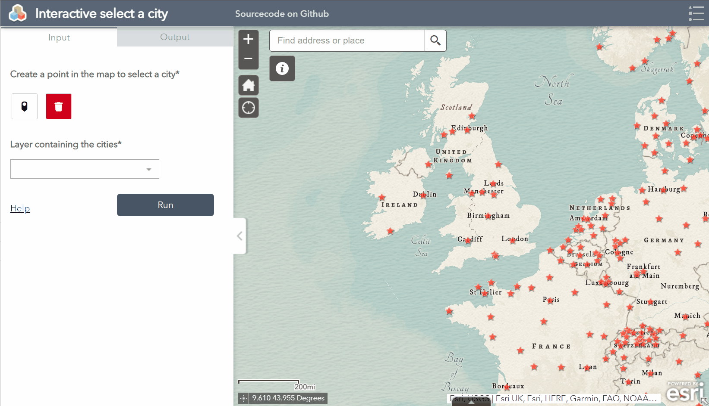

# Webtool selection
This sample shows how you can create an 'interactive' webmap without javascript. 
  
With an ArcGIS Webtool, created from an ArcGIS Python toolbox running inside a ArcGIS Webapp Builder App it's possible to make interactive selections in the map and use thoes selection for you python script.
In this case we make an easy selection for the nearest city or nearsest cities in case you created more then one point in the map. 

 
 
Try this example example live:
[here](https://devteam.esri.nl/portal/apps/webappviewer/index.html?id=f0129fae01884aad8824ef10e3868e34)

---

To learn more about Python toolboxes or webtools [Service areas](https://pro.arcgis.com/en/pro-app/latest/help/analysis/geoprocessing/share-analysis/publishing-web-tools-in-arcgis-pro.htm)
