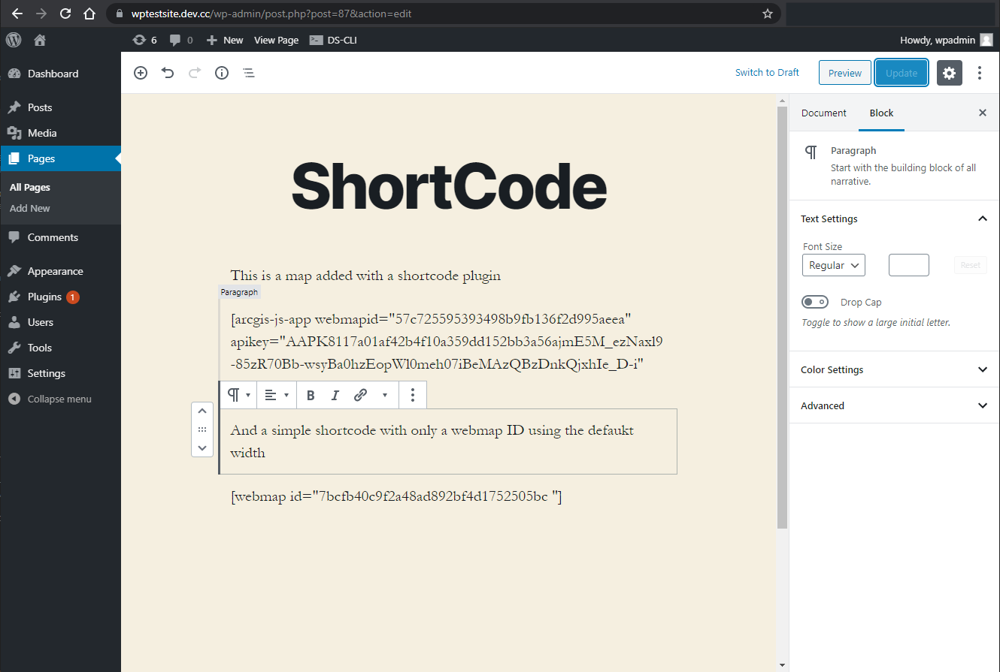
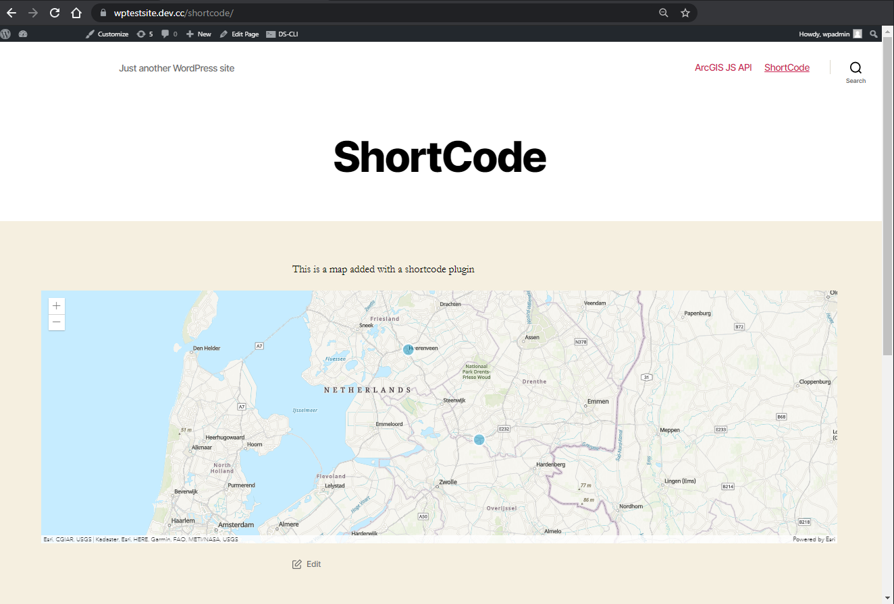

# Wordpress plugin

## Shortcode
Wordpress allows you to use a shortcode to add functionality. With the shortcode you basically define a set of properties that are used by the plugin.

## Using the plugin 
Copy and paste the complete "arcgis-js-api" folder into the "plugins" directory of your Wordpress installation. Alternatively you can navigate to the "plugins" section in your Wordpress admin section and choose "Upload Plugin" to upload the folder as a zip file.

Once the plugin is installed, navigate to the "Installed Plugins" and make sure to activate the plugin.

On the page where you want to add your map, add a new block called "shortcode". You could even use a regular Paragraph block if you want. In this block, add the following:

[arcgis-js-app webmapid="YOUR-WEBMAP-ID" apikey="YOUR-API-KEY" width="90%" height="500px"]

Click the "Update" button, navigate to the live page and refresh it to see your map on the page!

If your webmap is public you don't need to add an API key, nor do you need to set a width or height. In that case the minimum you need to add to the block is '[arcgis-js-app webmapid="YOUR-WEBMAP-ID"]'

 

 